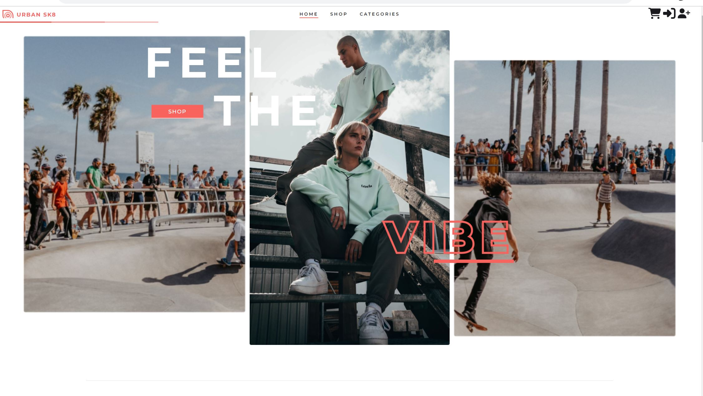
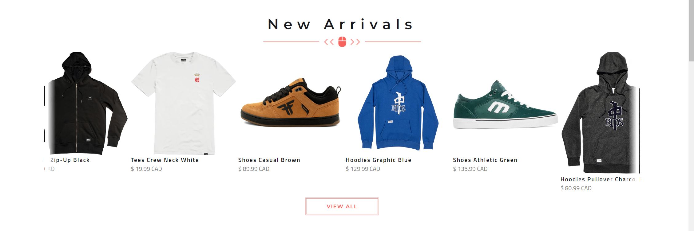
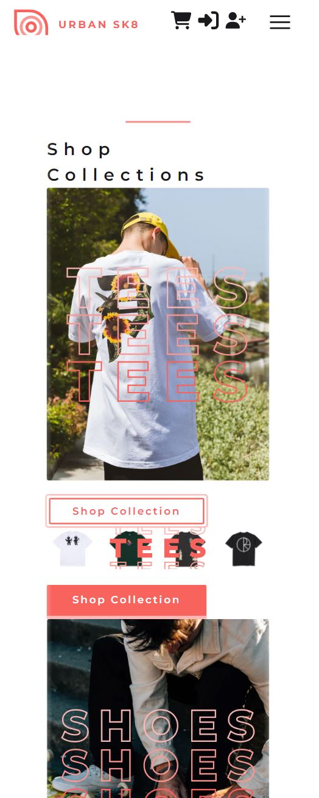
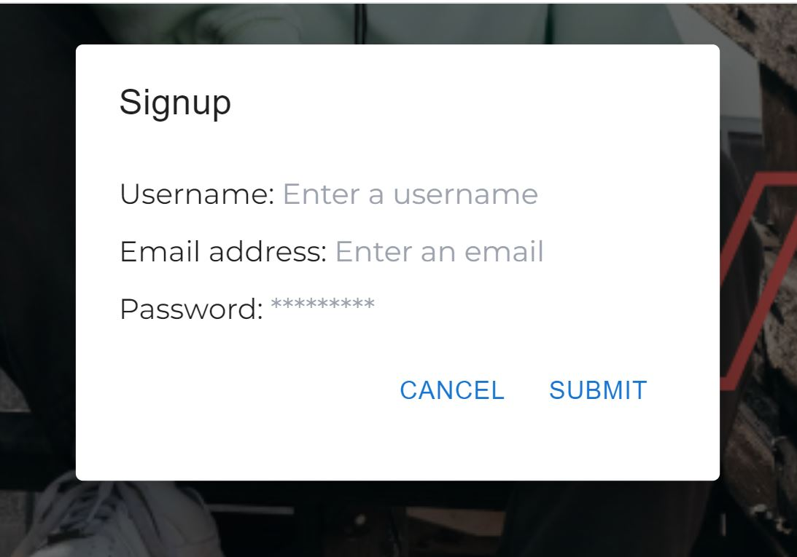
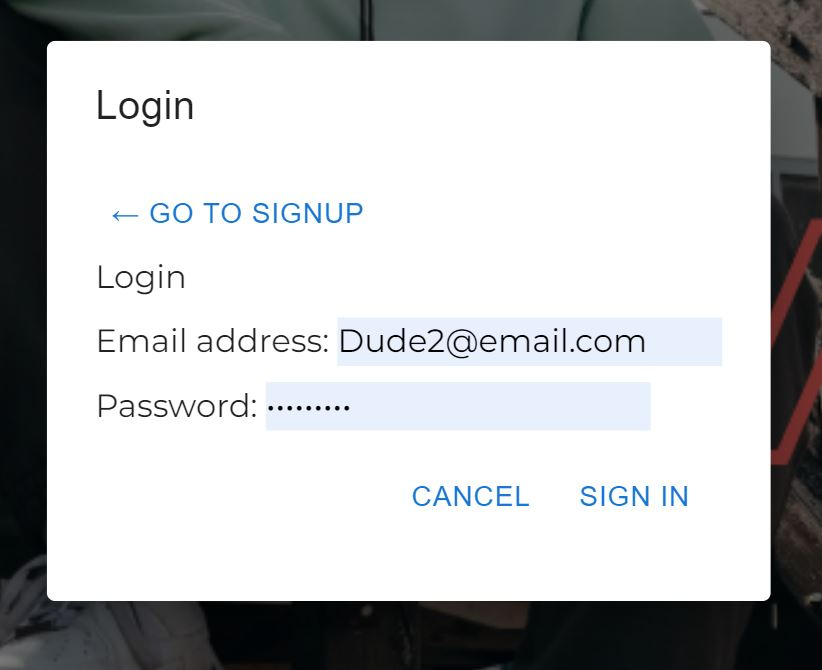
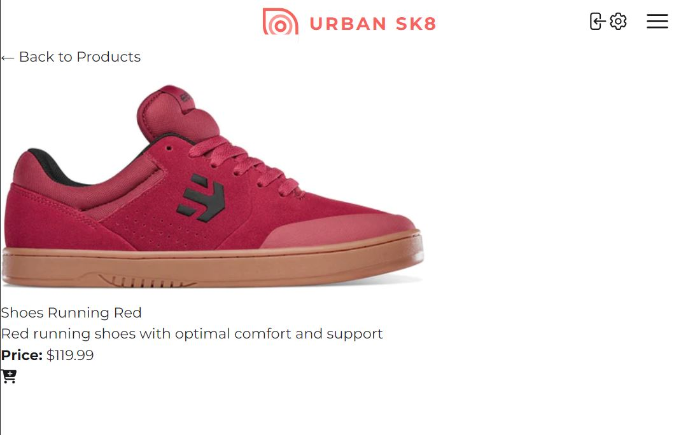

# ClotheSation - eCommerce

[](https://opensource.org/licenses/MIT)

## Description
In this group project we to embarked on a jourey to build an e-Commerce platform which allows users to choose products, add to cart, login to personal account, and purchase cart items utilizing Stripe. This app is built on MERN stack. Used Express and Node.js to build the server, implemented Model View Controller paradigm and interconnected a MongoDB no-SQL database using GraphQL. 

You can access the App from the [Deployment](#deployment) section below.

## Table of Contents
- [User-Story](#user-story)
- [Acceptance-Criteria](#acceptance-criteria)
- [Installation](#installation)
- [Usage](#usage)
- [License](#license)
- [Contributing](#contributing)
- [Test](#test)
- [Questions](#questions)
- [Deployment](#deployment)

## User-Story

```
AS A new clothing brand owner
I WANT an e-commerce platform
SO THAT I can upload my new collections and customers can purchase those from my platform.
```

## Acceptance-Criteria

```
GIVEN a e-commerce platform let's users purchase clothing
WHEN I load the e-commerce platform
THEN I am presented with a homepage, that includes a header with navbar, searchbar, cart and login/signup, a main part with the page contents and a footer with a sign up option for the newsletter and contact information.
WHEN I click on a navigation title
THEN I am presented with the corresponding section below the navigation without the page reloading and that title is highlighted
WHEN I am presented with the homepage
THEN I can see a banner of the brand, a description of the brand's mission, a carousel with products, featured product cards
WHEN I am presented with the contact page
THEN I can fillout a contact form with name, email address and message
(WHEN I am presented with the FAQ
I can look for questions that are frequently asked)
WHEN I click on the search for products searchbar option and I type in a specific productname 
THEN I will be redirected to the corresponding product page
WHEN I am presented with the product page for a single product
THEN I can see the product image, title, description, price, collection-name, add-to-cart-button and reviews in the bottom of the page
WHEN I am presented with the main product page
THEN I will see all the existing clothes (and a filter icon)
WHEN I click the add-to-cart button
THEN I will see the number at the cart icon increasing
WHEN I click on the cart
THEN I will see all items added to the cart listed, the current total price, a removal icon and and the option to add more items or checkout with Stripe
WHEN I click checkout with Stripe option
THEN I can enter my credit card information and purchase all the items in the cart
(WHEN I click the filter icon
THEN I can filter products based on newest, or oldest, price up and down and also based on collections)
WHEN I click on the Login/Signup menu option
THEN a modal appears on the screen with a toggle between the option to log in or sign up
WHEN the toggle is set to Signup
THEN I am presented with three inputs for a username, an email address, and a password, and a signup button
WHEN the toggle is set to Login
THEN I am presented with two inputs for an email address and a password and login button
WHEN I enter a valid email address and create a password and click on the signup button
THEN my user account is created and I am logged in to the site
WHEN I enter my account’s email address and password and click on the login button
THEN I the modal closes and I am logged in to the site
WHEN I am logged in 
THEN I can see the cart at a later point of time and have it saved in the account, (SAVE clothes, save purchase history)
```

## Installation
To get the app running, simply head on over to the deployed link on Heroku.

In the development environment you can run the following commands in the console:
```
npm install

npm run seed

npm run develop
```

for the production environment:
```
npm run build
```

## Usage
This app allows the user to choose products, add to cart, login to personal account, and purchase cart items utilizing Stripe.

The following images replicate the use of our app.








## License
This app is covered under MIT license. For details and limitations of this license please visit:
[License Link for MIT](https://opensource.org/licenses/MIT)


## Contributing
<!-- TBD -->

## Test
We are using jest for testing the development of the functions. No test have been written for this application yet.
<br>

## Questions
If you have any questions, you can email them to us.
  email: <link><br>

## Deployment

1. You can find the video walkthrough of a typical user flow of the application **here:** <br>
[Urban Sk8 - Deployed Link](https://urban-sk8-ef054e6c42c1.herokuapp.com/)<br>


2. You can find the URL of my GitHub repository that contains this code **here:** <br>[GitHub Repo - link](https://github.com/cdelacruzzin/ClotheStation)


### Authors Notes: 
  _This README and accompanying repo have been brought to you by:_<br>© Group 1 - 2023 CodeCamp Students.<br>Confidential and Proprietary. All Rights Reserved.